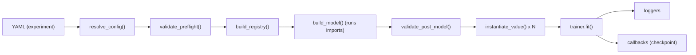

# offline_trainer

Minimal, YAML-driven training runner for PyTorch built around:

- a deterministic YAML resolver (composition + interpolation) from the vendored `policy_constructor/model_constructor`
- a registry for pluggable “components” (trainer/data/IO/loss/optim/scheduler/callbacks/loggers)
- a small single-device training loop with checkpoint + resume

This repo is intentionally small and modular: you should be able to build a custom training pipeline by (1) writing a plugin module under `extensions/` and (2) selecting your components from YAML, without touching core code.

## Table of contents

- [Quickstart](#quickstart)
- [Mental model](#mental-model)
- [Repo layout](#repo-layout)
- [Running an experiment](#running-an-experiment)
- [Configuration guide](#configuration-guide)
- [Component reference](#component-reference)
- [Writing custom components (plugins)](#writing-custom-components-plugins)
- [End-to-end tutorial: your own pipeline](#end-to-end-tutorial-your-own-pipeline)
- [Checkpointing and resume](#checkpointing-and-resume)
- [Debugging config errors](#debugging-config-errors)
- [FAQ](#faq)
- [Repo map](#repo-map)

## Quickstart

### 1) Create a venv + install deps

This repo is intentionally not packaged; run it from the repo root (so `import offline_trainer` works without extra setup).

```bash
python -m venv .venv
source .venv/bin/activate
python -m pip install --upgrade pip

# CPU-only example:
python -m pip install torch --index-url https://download.pytorch.org/whl/cpu
python -m pip install pyyaml

# Optional (for tests):
python -m pip install pytest
```

### 2) Train the baseline

```bash
python -c "from offline_trainer.experiment import run_experiment; run_experiment('configs/experiments/baseline.yaml')"
```

Outputs land in `runs/<run.name>/` (see `configs/experiments/baseline.yaml` and `configs/base/runtime.yaml`).

### 3) Try included variations

```bash
# Uses an extensions plugin to swap data + trainer
python -c "from offline_trainer.experiment import run_experiment; run_experiment('configs/experiments/custom_plugin.yaml')"

# Changes optimizer + adds a scheduler
python -c "from offline_trainer.experiment import run_experiment; run_experiment('configs/experiments/sgd_step_lr.yaml')"
```

## Mental model

There are two “construction systems” working together:

1. **Model construction** (architecture): driven by the `model:` section, built by `policy_constructor/model_constructor` into a `torch.nn.Module`.
2. **Component construction** (everything else): driven by `_type_` registry keys like `trainer.default`, `data.random_regression`, etc.

At runtime, `offline_trainer.experiment.run_experiment()` orchestrates:

1. **Resolve YAML** (`defaults`, `_merge_`, templates, `${...}`): `offline_trainer.deps.model_constructor.resolve_config(...)`
2. **Validate preflight** (basic structure + prefixes): `offline_trainer/config/validate.py::validate_preflight`
3. **Build registry** (model blocks + training components): `offline_trainer/registry/builder.py::build_registry`
4. **Build model**: `offline_trainer.deps.model_constructor.build_model(...)`
   - during model build, YAML `imports:` are executed and `register(registry)` hooks can add registry keys
5. **Validate post-model** (registry keys exist, IO matches model inputs): `offline_trainer/config/validate.py::validate_post_model`
6. **Instantiate components** from config via the registry: `instantiate_value(...)` for data/IO/loss/optim/sched/callbacks/loggers/trainer
7. **Train**: `trainer.fit(...)` (default loop in `offline_trainer/engine/trainer.py`)



## Repo layout

- `offline_trainer/`: main Python package (runner + registry + training loop)
- `configs/`: YAML configs (base defaults, models, experiments)
- `extensions/`: recommended home for your custom plugins/components
- `runs/`: default output directory for checkpoints/artifacts
- `policy_constructor/`: vendored dependency providing YAML resolver + model constructor (this repo treats it as an external library)

## Running an experiment

The “entrypoint” is a single function:

```python
from offline_trainer.experiment import run_experiment

run_experiment("configs/experiments/baseline.yaml")
```

If you prefer a one-liner:

```bash
python -c "from offline_trainer.experiment import run_experiment; run_experiment('configs/experiments/baseline.yaml')"
```

### What gets created on disk?

By convention the included experiments use:

- `run.name`: a short identifier like `baseline`
- `run.out_dir`: `runs/${run.name}`

With the default checkpoint callback (`cb.model_checkpoint`), you’ll see:

- `runs/<run.name>/checkpoints/last.pt`
- optionally `runs/<run.name>/checkpoints/step_<N>.pt`

## Configuration guide

The file you pass to `run_experiment(...)` is an “experiment YAML”. It is resolved into one merged mapping using `policy_constructor/model_constructor` features.

### 1) YAML composition (`defaults:`)

Included experiments use:

```yaml
defaults:
  - ../base/runtime.yaml
  - ../models/sequential_mlp.yaml
```

Rules of thumb:

- `defaults:` paths are relative to the YAML file that declares them.
- Later defaults override earlier defaults; then the current YAML overrides everything in `defaults:`.

### 2) Interpolation (`${...}`) and env vars

You can reference other config values:

```yaml
run:
  name: baseline
  out_dir: runs/${run.name}
```

The resolver also supports environment variables, for example:

```yaml
run:
  device: ${env:TRAIN_DEVICE}    # string
  seed: ${env:int:SEED}          # int
```

### 2b) Templates (`_template_`) (optional)

The resolver supports templates to reduce repetition in large YAMLs:

- Define reusable snippets under a top-level `templates:` mapping.
- Apply a template to a node via `_template_`.

This repo doesn’t rely on templates by default, but they’re available if you want them. For full semantics, see [`policy_constructor/model_constructor/config/README.md`](policy_constructor/model_constructor/config/README.md).

### 3) List merge directives (`_merge_` / `_value_`)

YAML lists replace by default. To append/prepend/replace explicitly, use a merge container:

```yaml
imports:
  _merge_: append
  _value_:
    - extensions.my_plugin
```

This repo also uses `_merge_: replace` to replace whole subtrees (see `configs/experiments/custom_plugin.yaml`).

### 4) Settings (safety + strictness)

`configs/base/runtime.yaml` defines the defaults:

```yaml
settings:
  strict: true
  allow_imports: true
  allow_target: false
  allowed_import_prefixes:
    - model_constructor.
    - offline_trainer.
    - extensions.
```

What these mean (beginner-friendly version):

- `strict: true`: unknown reserved keys like `_foo_` error early (helps catch typos).
- `allow_imports: true`: enables the top-level `imports:` list (used for plugins).
- `allow_target: false`: disables `_target_` (import-by-string) in specs. This prevents arbitrary code execution from YAML and nudges you toward registries.
- `allowed_import_prefixes`: guardrail for what modules can be imported via `imports:` (and `_target_` if enabled).

Security note: do not run untrusted YAML when `allow_imports: true` — `imports:` executes Python imports.

### 5) Spec format (`_type_`, `_args_`, `_kwargs_`)

Most non-model sections are “spec mappings” that look like:

```yaml
trainer:
  _type_: trainer.default
  max_epochs: 2
  log_every_n_steps: 10
```

Key points:

- `_type_` selects a registry key (not a Python import path).
- Remaining keys become constructor kwargs.
- You can also pass positional args via `_args_` and extra kwargs via `_kwargs_`:

  ```yaml
  loss:
    _type_: loss.torch
    fn:
      _type_: nn.MSELoss
      _kwargs_: {reduction: mean}
  ```

Nested specs are supported (like `loss.fn` above), but some fields are intentionally restricted to “pure data”:

- `optimizer.args`, `optimizer.kwargs`, `scheduler.args`, `scheduler.kwargs` must be plain data (no nested `_type_` / `_target_`), because they get forwarded into torch constructors.

### 6) Top-level keys used by this repo

After resolution, the merged config is expected to contain:

- `run` (required): run metadata + execution settings
  - required: `run.name`, `run.out_dir`
  - optional: `seed`, `device`, `precision`, `deterministic`, `resume_from`
- `model` (required): model-constructor schema (owned by `policy_constructor/model_constructor`)
- `imports` (optional): list of plugin modules to import (see below)
- `trainer` (required): `_type_: trainer.*`
- `data` (required): `_type_: data.*`
- `io` (required): `_type_: io.*`
- `loss` (required): `_type_: loss.*`
- `optimizer` (required): `_type_: optim_factory.*` and `type: optim_cls.*`
- `scheduler` (optional): `null` or `_type_: sched_factory.*` and `type: sched_cls.*`
- `callbacks` (optional): list of `_type_: cb.*`
- `loggers` (optional): list of `_type_: log.*`
- `metrics` (optional): list of `_type_: metric.*`

Concrete examples:

- `configs/base/runtime.yaml`
- `configs/experiments/*.yaml`

## Component reference

This section explains what each component is, what interface it must implement, and how it participates in the training loop.

If you only remember one rule: **the trainer is in charge**. Everything else (data/IO/loss/optim/scheduler/logging) is called by the trainer.

### Built-in registry keys (quick list)

Offline-trainer built-ins (registered in `offline_trainer/registry/builtins.py`):

- Trainers: `trainer.default`
- Data: `data.random_regression`
- IO: `io.mapping`
- Loss: `loss.torch` plus common torch loss modules under `nn.*` (for example `nn.MSELoss`, `nn.SmoothL1Loss`, `nn.CrossEntropyLoss`)
- Optimizers: factory `optim_factory.torch` plus optimizer classes under `optim_cls.*` (for example `optim_cls.AdamW`, `optim_cls.SGD`)
- Schedulers: factory `sched_factory.torch` plus scheduler classes under `sched_cls.*` (for example `sched_cls.StepLR`, `sched_cls.ReduceLROnPlateau`)
- Callbacks: `cb.model_checkpoint`
- Loggers: `log.stdout`
- Metrics: none registered by default (add via plugins)

To inspect what’s currently registered:

```python
from offline_trainer.registry import build_registry

reg = build_registry()
print(reg.list_modules())
```

### Trainer (`trainer.*`)

**Role:** owns the training loop and decides when to run forward/backward, logging, validation, checkpointing, scheduler stepping, etc.

**Default implementation:** `offline_trainer/engine/trainer.py::DefaultTrainer` (registry key `trainer.default`).

**Config fields (built-in):**

- `max_epochs`: number of epochs
- `grad_accum_steps`: accumulate gradients over N micro-batches
- `grad_clip_norm`: optional global grad norm clipping
- `log_every_n_steps`: logging cadence (steps)
- `val_every_n_epochs`: validation cadence (epochs)

**Behavior notes (DefaultTrainer):**

- `ctx.state.micro_step_in_epoch` increments once per *micro-batch* (each yielded batch from your dataloader).
- `ctx.state.global_step` increments once per *optimizer step* (after gradient accumulation), and is what loggers/callbacks/ckpt cadence uses.
- `on_train_step_end(ctx)` hooks run after each optimizer step (not after every micro-batch when `grad_accum_steps > 1`).

**Required interface (minimum):** implement `fit(...)` with keyword args:

```python
def fit(
    *,
    model,
    datamodule,
    io,
    loss,
    optimizer_factory,
    scheduler_factory,
    metrics,
    callbacks,
    loggers,
    registry,
    run,
) -> None: ...
```

Tip (recommended): rather than copy/pasting the whole loop, write a custom trainer that *wraps* the default trainer (see `extensions/example_plugin.py::VerboseTrainer`).

### Data module (`data.*`)

**Role:** produces training/validation batches.

**Default implementation:** `offline_trainer/components/data.py::RandomRegressionDataModule` (registry key `data.random_regression`).

**Required interface:**

- `setup(stage: str | None) -> None`
- `train_dataloader() -> Iterable[Any]`
- `val_dataloader() -> Iterable[Any] | None`

Notes:

- These “dataloaders” can be real `torch.utils.data.DataLoader` instances *or* simple Python iterables/generators.
- Each yielded `batch` can be a nested structure of tensors (dict/list/tuple/dataclass). The trainer will move all tensors to the selected device via `offline_trainer/engine/tree.py::move_to_device`.
- Your IO component decides how to interpret that batch.

### IO (`io.*`)

**Role:** converts each batch into `(model_inputs, targets, meta)`:

- `model_inputs` must have `.args: tuple` and `.kwargs: dict` so the trainer can call:
  `outputs = model(*model_inputs.args, **model_inputs.kwargs)`
- `targets` is passed into the loss and metrics
- `meta` is optional extra info (currently unused by the default trainer, but useful for custom trainers/callbacks)

**Default implementation:** `offline_trainer/components/io.py::MappingIO` (registry key `io.mapping`).

**MappingIO config:**

```yaml
io:
  _type_: io.mapping
  model_kwargs:
    x: [x]     # batch["x"] -> model(x=...)
  targets:
    y: [y]     # batch["y"] -> targets["y"]
```

Paths are `list[str|int]` segments:

- string segment: dict key
- int segment: list/tuple index

Examples:

- `["obs"]` means `batch["obs"]`
- `["obs", 0]` means `batch["obs"][0]`
- `["nested", "x"]` means `batch["nested"]["x"]`

**Post-model validation:** if your model has a `model.inputs: list[str]` attribute, `validate_post_model()` enforces that `io.mapping.model_kwargs` contains *exactly* those names (helpful typo-proofing).

### Loss (`loss.*`)

**Role:** computes a scalar loss tensor from `outputs` and `targets` (and optionally `batch`, `stage`).

**Required interface:** callable:

```python
loss_out = loss(outputs=outputs, targets=targets, batch=batch, stage="train")
loss_tensor = loss_out.loss  # must be a scalar torch.Tensor
```

`loss_out` may optionally include a `logs` dict (numbers or 0-dim tensors) that the trainer will merge into step logs.

**Default implementation:** `offline_trainer/components/loss.py::TorchLoss` (registry key `loss.torch`)

It wraps a standard PyTorch loss module/function (for example `nn.MSELoss`) and supports selecting tensors out of nested structures:

```yaml
loss:
  _type_: loss.torch
  fn: {_type_: nn.MSELoss}
  # Optional:
  # pred_path: ["pred"]      # if outputs is a dict like {"pred": tensor}
  # target_path: ["y"]       # if targets is a dict like {"y": tensor}
```

### Optimizer factory (`optim_factory.*`) and optimizer classes (`optim_cls.*`)

**Role:** builds a `torch.optim.Optimizer` for the model.

Why a factory (instead of configuring the optimizer directly)?

- It keeps “how to build parameter groups” in Python where it belongs.
- It allows selecting optimizers by registry key and validating kwargs.

**Default implementation:** `offline_trainer/components/optim.py::TorchOptimizerFactory` (registry key `optim_factory.torch`)

Example:

```yaml
optimizer:
  _type_: optim_factory.torch
  type: optim_cls.AdamW
  kwargs: {lr: 1.0e-3, weight_decay: 1.0e-2}
```

Restrictions:

- `optimizer.args` / `optimizer.kwargs` must be plain YAML data (no nested `_type_` specs).

### Scheduler factory (`sched_factory.*`) and scheduler classes (`sched_cls.*`)

**Role:** builds a scheduler and tells the trainer *when* to step it.

**Default implementation:** `offline_trainer/components/sched.py::TorchSchedulerFactory` (registry key `sched_factory.torch`)

Example:

```yaml
scheduler:
  _type_: sched_factory.torch
  type: sched_cls.StepLR
  kwargs: {step_size: 1, gamma: 0.8}
  interval: epoch        # step | epoch | metric
  frequency: 1
  # monitor: val_loss    # required only when interval: metric
```

Notes:

- `interval: step`: stepped every `frequency` optimizer steps.
- `interval: epoch`: stepped every `frequency` epochs.
- `interval: metric`: stepped with a metric value; with the built-in trainer this is effectively limited to `monitor: val_loss` unless you write a custom trainer that populates additional validation metrics.

Restrictions:

- `scheduler.args` / `scheduler.kwargs` must be plain YAML data (no nested `_type_` specs).

### Callbacks (`cb.*`)

**Role:** side effects around the training loop (checkpointing, early stopping, custom logging, etc.).

The default trainer calls (if present):

- `on_fit_start(ctx)`
- `on_train_step_end(ctx)`
- `on_epoch_end(ctx)`
- `on_exception(ctx, exc)`
- `on_fit_end(ctx)`

Checkpointing support:

- If a callback defines `state_dict()` / `load_state_dict(state)`, its state is saved/restored as part of checkpoints.
- On resume, callbacks must match the checkpoint: the checkpoint restore currently expects the **same number of callbacks in the same order**.

Useful context: callback hooks receive a `RunContext` (`offline_trainer/engine/state.py::RunContext`) with references to `model`, `optimizer`, `scheduler`, `datamodule`, `io`, `loss`, `metrics`, `loggers`, and the latest `last_train_logs` / `last_val_logs`.

**Default implementation:** `offline_trainer/components/callbacks.py::ModelCheckpoint` (registry key `cb.model_checkpoint`).

### Loggers (`log.*`)

**Role:** emit metrics/hparams to stdout, files, dashboards, etc.

The default trainer calls:

- `logger.log_hparams({...})` once at fit start (if the method exists)
- `logger.log_metrics(metrics, step=..., stage=...)` every `trainer.log_every_n_steps` (train) and after validation (val)
- `logger.close()` at the end (if the method exists)

**Default implementation:** `offline_trainer/components/loggers.py::StdoutLogger` (registry key `log.stdout`).

### Metrics (`metric.*`)

**Role:** compute additional training/validation metrics.

Important: the built-in `DefaultTrainer` currently only calls `metric.update(...)` each batch; it does not automatically call `compute()`/`reset()` or log metric values. If you want “real” metrics, you have two common options:

1. Write a custom trainer that calls `compute()`/`reset()` and logs results.
2. Write a callback that reads metric objects and logs them at the cadence you want.

## Writing custom components (plugins)

Plugins are plain Python modules that are imported from YAML via the top-level `imports:` list. If a module defines:

- `register(registry) -> None`

…then the model-constructor import mechanism will call it during model build, letting you register new component keys.

### 1) Create a plugin module

Create a new file under `extensions/`, for example `extensions/my_plugin.py`, and register your components:

```python
from __future__ import annotations

from dataclasses import dataclass
from typing import Any, Iterable

import torch

from offline_trainer.components.io import ArgsKwargs
from offline_trainer.components.loss import LossOutput
from offline_trainer.engine.state import RunContext


@dataclass
class MyDataModule:
    batch_size: int = 32
    steps_per_epoch: int = 100

    def setup(self, stage: str | None = None) -> None:
        return

    def train_dataloader(self) -> Iterable[Any]:
        for _ in range(self.steps_per_epoch):
            x = torch.randn(self.batch_size, 32)
            y = torch.randn(self.batch_size, 16)
            yield {"x": x, "y": y}

    def val_dataloader(self) -> Iterable[Any] | None:
        return None


@dataclass
class MyIO:
    def split(self, batch: Any, *, stage: str):
        model_inputs = ArgsKwargs(kwargs={"x": batch["x"]})
        targets = {"y": batch["y"]}
        return model_inputs, targets, {"stage": stage}


@dataclass
class MyLoss:
    def __call__(self, *, outputs: Any, targets: Any, batch: Any, stage: str) -> LossOutput:
        pred = outputs
        tgt = targets["y"]
        loss = torch.mean((pred - tgt) ** 2)
        return LossOutput(loss=loss, logs={"mse": loss})


@dataclass
class PrintOnEpochEnd:
    def on_epoch_end(self, ctx: RunContext) -> None:
        print(f"epoch={ctx.state.epoch} last_train={ctx.last_train_logs}")


def register(registry) -> None:
    registry.register_module("data.my_data", MyDataModule, signature_policy="strict", tags=("data", "ext"))
    registry.register_module("io.my_io", MyIO, signature_policy="strict", tags=("io", "ext"))
    registry.register_module("loss.my_loss", MyLoss, signature_policy="strict", tags=("loss", "ext"))
    registry.register_module("cb.print_epoch", PrintOnEpochEnd, signature_policy="strict", tags=("callback", "ext"))
```

Naming tips:

- Use globally unique keys. A common pattern is `domain.<project>.<name>` (e.g. `trainer.my_team.debug`).
- Prefer `signature_policy="strict"` so YAML typos fail fast.

### 2) Import the plugin from YAML

In your experiment YAML:

```yaml
imports:
  - extensions.my_plugin
```

If you want to keep your plugins outside `extensions/`, update `settings.allowed_import_prefixes` accordingly.

### 3) Select your custom components

Once imported, you can reference the registered keys:

```yaml
data:
  _type_: data.my_data

io:
  _type_: io.my_io

loss:
  _type_: loss.my_loss

callbacks:
  - _type_: cb.print_epoch
```

### 4) Full plugin example (data + IO + loss + optimizer + scheduler + trainer + metric + callback + logger)

If you want a “single copy/paste” template that demonstrates *every* extension point, this example registers:

- a custom data module (`data.tutorial_regression`)
- a custom IO splitter (`io.tutorial`)
- a custom loss (`loss.mse_l2`)
- a custom optimizer factory with parameter groups (`optim_factory.adamw_no_decay`)
- a custom scheduler factory that supplies a Python callable (`sched_factory.warmup_lambda`)
- a custom metric (`metric.mean_abs_error`)
- a custom callback that logs metrics at epoch end (`cb.log_metrics`)
- a custom JSONL logger (`log.jsonl`)
- a custom trainer that delegates to `trainer.default` (`trainer.tutorial`)

Create `extensions/tutorial_full.py`:

```python
from __future__ import annotations

import json
from dataclasses import dataclass
from pathlib import Path
from typing import Any, Iterable

import torch

from offline_trainer.components.io import ArgsKwargs
from offline_trainer.components.loss import LossOutput
from offline_trainer.components.sched import SchedulerBundle
from offline_trainer.deps.model_constructor import Registry, validate_kwargs
from offline_trainer.engine.state import RunContext


@dataclass
class TutorialRegressionDataModule:
    batch_size: int = 32
    steps_per_epoch: int = 20
    val_steps_per_epoch: int = 5
    x_shape: list[int] = None  # type: ignore[assignment]
    y_shape: list[int] = None  # type: ignore[assignment]

    def __post_init__(self) -> None:
        if self.x_shape is None:
            self.x_shape = [32]
        if self.y_shape is None:
            self.y_shape = [16]

    def setup(self, stage: str | None = None) -> None:
        return

    def train_dataloader(self) -> Iterable[Any]:
        for _ in range(self.steps_per_epoch):
            x = torch.randn(self.batch_size, *self.x_shape)
            y = torch.randn(self.batch_size, *self.y_shape)
            yield {"x": x, "y": y}

    def val_dataloader(self) -> Iterable[Any] | None:
        if self.val_steps_per_epoch <= 0:
            return None
        for _ in range(self.val_steps_per_epoch):
            x = torch.randn(self.batch_size, *self.x_shape)
            y = torch.randn(self.batch_size, *self.y_shape)
            yield {"x": x, "y": y}


@dataclass
class TutorialIO:
    model_arg_name: str = "x"  # name expected by the model's forward(...), e.g. forward(x=...)
    input_key: str = "x"  # where to find the input in the batch dict
    target_key: str = "y"  # where to find the target in the batch dict

    def split(self, batch: Any, *, stage: str):
        x = batch[self.input_key]
        y = batch[self.target_key]
        return ArgsKwargs(kwargs={self.model_arg_name: x}), {self.target_key: y}, {"stage": stage}


@dataclass
class MSEWithOutputL2:
    target_key: str = "y"
    output_l2_coeff: float = 0.0

    def __call__(self, *, outputs: Any, targets: Any, batch: Any, stage: str) -> LossOutput:
        pred = outputs
        tgt = targets[self.target_key]
        mse = torch.mean((pred - tgt) ** 2)
        l2 = torch.mean(pred**2) * float(self.output_l2_coeff)
        return LossOutput(loss=mse + l2, logs={"mse": mse, "out_l2": l2})


@dataclass
class AdamWNoDecayFactory:
    type: str  # must be an optim_cls.* registry key (validated by offline_trainer)
    args: list[Any] | None = None
    kwargs: dict[str, Any] | None = None
    no_decay_substrings: tuple[str, ...] = ("bias", "LayerNorm.weight")

    def build(self, model: torch.nn.Module, *, registry: Registry) -> torch.optim.Optimizer:
        args = list(self.args or [])
        kwargs = dict(self.kwargs or {})

        entry = registry.get_module(self.type)
        optim_cls = entry.target
        validate_kwargs(optim_cls, kwargs=kwargs, policy=entry.signature_policy, config_path=("optimizer", "kwargs"))

        weight_decay = float(kwargs.pop("weight_decay", 0.0))
        decay_params: list[torch.nn.Parameter] = []
        no_decay_params: list[torch.nn.Parameter] = []
        for name, param in model.named_parameters():
            if not param.requires_grad:
                continue
            if any(s in name for s in self.no_decay_substrings):
                no_decay_params.append(param)
            else:
                decay_params.append(param)

        param_groups = [
            {"params": decay_params, "weight_decay": weight_decay},
            {"params": no_decay_params, "weight_decay": 0.0},
        ]
        return optim_cls(param_groups, *args, **kwargs)


@dataclass
class WarmupLambdaSchedulerFactory:
    type: str  # must be a sched_cls.* registry key (validated by offline_trainer)
    args: list[Any] | None = None
    kwargs: dict[str, Any] | None = None
    interval: str = "step"  # step | epoch | metric
    frequency: int = 1
    monitor: str | None = None
    warmup_steps: int = 100
    warmup_start_factor: float = 0.0

    def build(self, optimizer: torch.optim.Optimizer, *, registry: Registry) -> SchedulerBundle:
        args = list(self.args or [])
        kwargs = dict(self.kwargs or {})

        def lr_lambda(step: int) -> float:
            if self.warmup_steps <= 0:
                return 1.0
            if step < self.warmup_steps:
                t = float(step + 1) / float(self.warmup_steps)
                return float(self.warmup_start_factor) + (1.0 - float(self.warmup_start_factor)) * t
            return 1.0

        kwargs["lr_lambda"] = lr_lambda

        entry = registry.get_module(self.type)
        sched_cls = entry.target
        validate_kwargs(sched_cls, kwargs=kwargs, policy=entry.signature_policy, config_path=("scheduler", "kwargs"))

        sched = sched_cls(optimizer, *args, **kwargs)
        return SchedulerBundle(scheduler=sched, interval=self.interval, frequency=self.frequency, monitor=self.monitor)


@dataclass
class MeanAbsError:
    target_key: str = "y"
    _train_sum: float = 0.0
    _train_count: int = 0
    _val_sum: float = 0.0
    _val_count: int = 0

    def update(self, *, outputs: Any, targets: Any, batch: Any, stage: str) -> None:
        pred = outputs
        tgt = targets[self.target_key]
        mae = torch.mean(torch.abs(pred - tgt))
        val = float(mae.detach().cpu().item())
        if stage == "train":
            self._train_sum += val
            self._train_count += 1
        else:
            self._val_sum += val
            self._val_count += 1

    def compute(self) -> dict[str, float]:
        out: dict[str, float] = {}
        if self._train_count:
            out["train/mae"] = self._train_sum / float(self._train_count)
        if self._val_count:
            out["val/mae"] = self._val_sum / float(self._val_count)
        return out

    def reset(self) -> None:
        self._train_sum = 0.0
        self._train_count = 0
        self._val_sum = 0.0
        self._val_count = 0


@dataclass
class LogMetricsCallback:
    def on_epoch_end(self, ctx: RunContext) -> None:
        logs: dict[str, float] = {}

        for m in ctx.metrics:
            if hasattr(m, "compute"):
                logs.update(m.compute())
            if hasattr(m, "reset"):
                m.reset()

        try:
            logs["lr"] = float(ctx.optimizer.param_groups[0]["lr"])
        except Exception:
            pass

        if logs and ctx.state.global_step:
            for lg in ctx.loggers:
                lg.log_metrics(logs, step=ctx.state.global_step, stage="metrics")


@dataclass
class JSONLLogger:
    path: str
    _fh: Any = None

    def log_hparams(self, hparams: dict[str, Any]) -> None:
        p = Path(self.path)
        p.parent.mkdir(parents=True, exist_ok=True)
        self._fh = open(p, "a", encoding="utf-8")
        self._fh.write(json.dumps({"type": "hparams", "hparams": hparams}) + "\n")
        self._fh.flush()

    def log_metrics(self, metrics: dict[str, float], *, step: int, stage: str) -> None:
        if self._fh is None:
            return
        self._fh.write(json.dumps({"type": "metrics", "stage": stage, "step": step, "metrics": metrics}) + "\n")
        self._fh.flush()

    def close(self) -> None:
        if self._fh is not None:
            self._fh.close()
            self._fh = None


@dataclass
class TutorialTrainer:
    max_epochs: int = 2
    grad_accum_steps: int = 1
    grad_clip_norm: float | None = None
    log_every_n_steps: int = 10
    val_every_n_epochs: int = 1

    def fit(self, **kwargs: Any) -> None:
        print("Running TutorialTrainer (delegating to trainer.default)")
        default_trainer_cls = kwargs["registry"].get_module("trainer.default").target
        default_trainer = default_trainer_cls(
            max_epochs=self.max_epochs,
            grad_accum_steps=self.grad_accum_steps,
            grad_clip_norm=self.grad_clip_norm,
            log_every_n_steps=self.log_every_n_steps,
            val_every_n_epochs=self.val_every_n_epochs,
        )
        default_trainer.fit(**kwargs)


def register(registry) -> None:
    # Custom components
    registry.register_module("trainer.tutorial", TutorialTrainer, signature_policy="strict", tags=("trainer", "ext"))
    registry.register_module("data.tutorial_regression", TutorialRegressionDataModule, signature_policy="strict", tags=("data", "ext"))
    registry.register_module("io.tutorial", TutorialIO, signature_policy="strict", tags=("io", "ext"))
    registry.register_module("loss.mse_l2", MSEWithOutputL2, signature_policy="strict", tags=("loss", "ext"))
    registry.register_module("optim_factory.adamw_no_decay", AdamWNoDecayFactory, signature_policy="strict", tags=("optim", "factory", "ext"))
    registry.register_module("sched_factory.warmup_lambda", WarmupLambdaSchedulerFactory, signature_policy="strict", tags=("sched", "factory", "ext"))
    registry.register_module("metric.mean_abs_error", MeanAbsError, signature_policy="strict", tags=("metric", "ext"))
    registry.register_module("cb.log_metrics", LogMetricsCallback, signature_policy="strict", tags=("callback", "ext"))
    registry.register_module("log.jsonl", JSONLLogger, signature_policy="strict", tags=("logger", "ext"))

    # Register a scheduler class that isn't included by default (because it needs a Python callable).
    registry.register_module(
        "sched_cls.LambdaLR",
        torch.optim.lr_scheduler.LambdaLR,
        signature_policy="strict",
        tags=("torch.optim.lr_scheduler", "sched_cls"),
    )
```

Then create `configs/experiments/tutorial_full.yaml`:

```yaml
defaults:
  - ../base/runtime.yaml
  - ../models/sequential_mlp.yaml

imports: [extensions.tutorial_full]

run:
  name: tutorial_full
  out_dir: runs/${run.name}
  seed: 0
  device: cpu
  precision: fp32
  deterministic: true

trainer:
  _merge_: replace
  _value_:
    _type_: trainer.tutorial
    max_epochs: 2
    log_every_n_steps: 10
    val_every_n_epochs: 1

data:
  _merge_: replace
  _value_:
    _type_: data.tutorial_regression
    batch_size: 32
    steps_per_epoch: 20
    val_steps_per_epoch: 5
    x_shape: [32]
    y_shape: [16]

io:
  _merge_: replace
  _value_:
    _type_: io.tutorial
    model_arg_name: x
    input_key: x
    target_key: y

loss:
  _merge_: replace
  _value_:
    _type_: loss.mse_l2
    target_key: y
    output_l2_coeff: 0.0

optimizer:
  _merge_: replace
  _value_:
    _type_: optim_factory.adamw_no_decay
    type: optim_cls.AdamW
    kwargs: {lr: 1.0e-3, weight_decay: 1.0e-2}

scheduler:
  _merge_: replace
  _value_:
    _type_: sched_factory.warmup_lambda
    type: sched_cls.LambdaLR
    warmup_steps: 50
    interval: step

metrics:
  _merge_: replace
  _value_:
    - _type_: metric.mean_abs_error
      target_key: y

loggers:
  _merge_: replace
  _value_:
    - _type_: log.stdout
      every_n_steps: 10
    - _type_: log.jsonl
      path: ${run.out_dir}/metrics.jsonl

callbacks:
  _merge_: replace
  _value_:
    - _type_: cb.model_checkpoint
      save_dir: ${run.out_dir}/checkpoints
      save_last: true
      every_n_steps: 10
    - _type_: cb.log_metrics
```

Run it:

```bash
python -c "from offline_trainer.experiment import run_experiment; run_experiment('configs/experiments/tutorial_full.yaml')"
```

## End-to-end tutorial: your own pipeline

This tutorial shows the recommended workflow to build a fully custom pipeline (custom components + custom YAML experiment), while keeping core code untouched.

### Step 1: start from the baseline experiment

Copy (conceptually) what `configs/experiments/baseline.yaml` does:

- compose base runtime + a model
- set `run.name` and `run.out_dir`
- override only what you need

### Step 2: write a plugin with the components you need

Use `extensions/example_plugin.py` as the smallest working pattern:

- define component classes
- define `register(registry)` that calls `registry.register_module(...)`

Keep the interfaces in mind:

- data: `setup`, `train_dataloader`, `val_dataloader`
- io: `split(batch, stage)`
- loss: `__call__(outputs, targets, batch, stage) -> LossOutput`
- callbacks/loggers: implement only the hooks you need
- trainer: implement `fit(...)` (or wrap `trainer.default`)

### Step 3: create a new experiment YAML that uses your plugin

Here’s a self-contained example you can run immediately (it uses the shipped `extensions.example_plugin` and built-in torch optimizer/scheduler factories).

```bash
cat > /tmp/offline_trainer_end_to_end.yaml <<'YAML'
schema_version: 1

settings:
  strict: true
  allow_imports: true
  allow_target: false
  allowed_import_prefixes: [model_constructor., offline_trainer., extensions.]

imports: [extensions.example_plugin]

run:
  name: end_to_end
  out_dir: runs/${run.name}
  device: cpu
  precision: fp32
  deterministic: true

model:
  sequential:
    inputs: [x]
    layers:
      - _type_: mlp
        dims: [null, 64, 16]
        dropout: 0.1

data:
  _type_: data.constant_regression
  batch_size: 16
  steps_per_epoch: 10
  x_shape: [32]
  y_shape: [16]

io:
  _type_: io.mapping
  model_kwargs: {x: [x]}
  targets: {y: [y]}

loss:
  _type_: loss.torch
  fn: {_type_: nn.SmoothL1Loss}

optimizer:
  _type_: optim_factory.torch
  type: optim_cls.SGD
  kwargs: {lr: 1.0e-2, momentum: 0.9}

scheduler:
  _type_: sched_factory.torch
  type: sched_cls.StepLR
  kwargs: {step_size: 1, gamma: 0.8}
  interval: epoch

trainer:
  _type_: trainer.verbose
  max_epochs: 1
  log_every_n_steps: 5

loggers:
  - _type_: log.stdout
    every_n_steps: 5

callbacks:
  - _type_: cb.model_checkpoint
    save_dir: ${run.out_dir}/checkpoints
    save_last: true
    every_n_steps: 5
YAML

python -c "from offline_trainer.experiment import run_experiment; run_experiment('/tmp/offline_trainer_end_to_end.yaml')"
```

### Step 4: iterate

Typical iteration loop:

1. Add/change a component in `extensions/`
2. Register it under a new `_type_` key
3. Swap it in your experiment YAML
4. Re-run `run_experiment(...)`

## Checkpointing and resume

Checkpointing is implemented in `offline_trainer/engine/checkpoint.py`. A checkpoint includes:

- model `state_dict`
- optimizer state
- scheduler state (if configured)
- AMP scaler state (for fp16-mixed)
- callback state (`state_dict()` results)
- training state: `epoch`, `global_step`, `micro_step_in_epoch`
- RNG state (torch, optionally cuda, numpy/python when available)

### Enabling checkpointing

Use the built-in callback:

```yaml
callbacks:
  - _type_: cb.model_checkpoint
    save_dir: ${run.out_dir}/checkpoints
    save_last: true
    every_n_steps: 100
```

### Resuming

Point `run.resume_from` at a `.pt` file:

```yaml
run:
  resume_from: runs/my_run/checkpoints/last.pt
```

Gotchas (common):

- The callback list must match the checkpoint (same length/order) for restore to succeed.
- If a checkpoint contains scheduler state, you must configure a scheduler when resuming.
- Resuming onto a different device is supported (checkpoint loads on CPU first), but ensure your config’s `run.device` is correct.

## Debugging config errors

Most failures are raised as `ConfigError` with a dotted `path=...` and (when available) `loc=file:line:col`.

To print a helpful snippet:

```python
from offline_trainer.config.errors import format_error_with_context
from offline_trainer.deps.model_constructor import ConfigError
from offline_trainer.experiment import run_experiment

try:
    run_experiment("configs/experiments/baseline.yaml")
except ConfigError as exc:
    print(format_error_with_context(exc))
    raise
```

### Common causes and fixes

- **Unknown registry key**: check `_type_` strings; ensure your plugin is listed under `imports:`.
- **Imports blocked**: ensure `settings.allowed_import_prefixes` includes your module prefix.
- **IO mapping mismatch**: ensure `io.mapping.model_kwargs` keys match the model’s `inputs`.
- **Scheduler interval=metric**: requires `scheduler.monitor` and validation to run that epoch.
- **Nested specs inside optimizer/scheduler args/kwargs**: these fields must be pure data (no `_type_` / `_target_`).

### Debugging registry contents

If you’re unsure what keys exist:

```python
from offline_trainer.registry import build_registry

reg = build_registry()
print([k for k in reg.list_modules() if k.startswith("trainer.")])
```

## FAQ

### “How do I add a new optimizer/scheduler/loss that isn’t already registered?”

Register it in a plugin:

- optimizers: register your class under `optim_cls.<Name>` (or write a custom `optim_factory.*`)
- schedulers: register under `sched_cls.<Name>` (or write a custom `sched_factory.*`)
- torch loss modules: many `nn.*Loss` modules are already registered; register additional ones if needed

### “Why does the repo use registries instead of importing classes directly from YAML?”

It’s a reproducibility + safety tradeoff:

- `_type_` selects from an explicit allowlist (the registry)
- `settings.allow_target: false` disables arbitrary `_target_` imports by default
- plugins still let you extend the allowlist in a controlled way

### “How do I run on GPU / mixed precision?”

Set in `run:`:

```yaml
run:
  device: cuda
  precision: bf16-mixed   # or fp16-mixed (requires CUDA)
```

If you request `cuda` but `torch.cuda.is_available()` is false, validation will fail early.

## Repo map

- [`offline_trainer/README.md`](offline_trainer/README.md): the training runner package (entrypoints + pipeline)
- [`configs/README.md`](configs/README.md): config layout and how includes/overrides are used here
- [`extensions/README.md`](extensions/README.md): plugin pattern used by `imports:`
- [`tests/README.md`](tests/README.md): what the tests cover + how to run them
- [`runs/README.md`](runs/README.md): example output directory layout (checkpoints)
- [`policy_constructor/README.md`](policy_constructor/README.md): vendored model-constructor library (separate docs; not owned by this repo)
