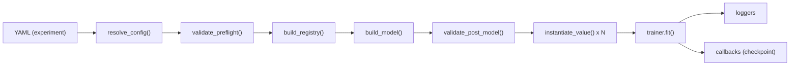

# offline_trainer

Minimal, YAML-driven training loop built around a **registry** + a **YAML-first model constructor**.

- This repo owns: training loop, checkpointing, simple logging, and component wiring (data/IO/loss/optim/scheduler/trainer).
- This repo does **not** own model-architecture semantics: models are built by the vendored `policy_constructor/model_constructor` library.

## Quickstart

### 1) Create a venv + install deps

This repo is intentionally not packaged; run it from the repo root.

```bash
python -m venv .venv
source .venv/bin/activate
python -m pip install --upgrade pip

# CPU-only example:
python -m pip install torch --index-url https://download.pytorch.org/whl/cpu
python -m pip install pyyaml

# Optional (for tests):
python -m pip install pytest
```

### 2) Train the baseline

```bash
python -c "from offline_trainer.experiment import run_experiment; run_experiment('configs/experiments/baseline.yaml')"
```

Outputs land in `runs/<run.name>/` (see `configs/experiments/baseline.yaml` and `configs/base/runtime.yaml`).

### 3) Try included variations

```bash
# Uses an extensions plugin to swap data + trainer
python -c "from offline_trainer.experiment import run_experiment; run_experiment('configs/experiments/custom_plugin.yaml')"

# Changes optimizer + adds a scheduler
python -c "from offline_trainer.experiment import run_experiment; run_experiment('configs/experiments/sgd_step_lr.yaml')"
```

## Architecture (tour)

At runtime, `offline_trainer.experiment.run_experiment()` orchestrates:

1. **Resolve YAML** (composition, interpolation, imports settings): `offline_trainer.deps.model_constructor.resolve_config(...)`
2. **Validate** the run + component specs (preflight): `offline_trainer/config/validate.py`
3. **Build registry** (model blocks + trainer components): `offline_trainer/registry/builder.py`
4. **Build model** from YAML: `offline_trainer.deps.model_constructor.build_model(...)`
   - during model build, YAML `imports:` are executed and `register(registry)` hooks may add keys
5. **Instantiate** non-model components from config via the registry: data, IO, loss, optimizer factory, scheduler factory, callbacks, loggers
6. **Train**: `trainer.fit(...)` (default loop in `offline_trainer/engine/trainer.py`)



## Config system (what YAML keys mean)

All runs are driven by a single “experiment YAML” that ends up as one merged mapping.

### Composition and interpolation

This repo uses the config resolver from `policy_constructor/model_constructor`, so you get:

- `defaults:` file-based includes (paths are relative to the YAML file)
- `${...}` interpolation (e.g. `${run.out_dir}`)
- list merge directives via `_merge_` / `_value_` (used in `configs/experiments/custom_plugin.yaml`)

See the authoritative docs in:
- [policy_constructor/model_constructor/config/README.md](policy_constructor/model_constructor/config/README.md)

### Top-level keys used by this repo

The merged config is expected to contain:

- `run`: run metadata + execution settings (required)
  - required: `run.name`, `run.out_dir`
  - optional: `seed`, `device`, `precision`, `deterministic`, `resume_from`
- `model`: model-constructor schema (required; owned by `policy_constructor/model_constructor`)
- `imports`: optional list of Python modules to import before construction (see “Plugins”)
- `trainer`: `_type_: trainer.*` (required)
- `data`: `_type_: data.*` (required)
- `io`: `_type_: io.*` (required)
- `loss`: `_type_: loss.*` (required)
- `optimizer`: `_type_: optim_factory.*` + `type: optim_cls.*` (required)
- `scheduler`: `null` or `_type_: sched_factory.*` + `type: sched_cls.*` (optional)
- `callbacks`: list of `_type_: cb.*` (optional)
- `loggers`: list of `_type_: log.*` (optional)
- `metrics`: list of `_type_: metric.*` (optional; no built-ins are registered by default)

Concrete examples live in:
- `configs/base/runtime.yaml`
- `configs/experiments/*.yaml`

### How IO mapping works (`io.mapping`)

The built-in IO component (`_type_: io.mapping`) extracts model inputs/targets from each batch using “paths”.

Example (from `configs/base/runtime.yaml`):

```yaml
io:
  _type_: io.mapping
  model_kwargs: {x: [x]}
  targets: {y: [y]}
```

Interpretation:
- `model_kwargs.x: [x]` means “take `batch['x']` and pass it as the `x=` kwarg to the model”.
- `targets.y: [y]` means “take `batch['y']` and expose it to the loss as target `y`”.

Paths are `list[str|int]` segments:
- string segment: dict key
- int segment: list/tuple index

`validate_post_model()` checks that `io.mapping.model_kwargs` contains **exactly** the model’s declared inputs (`model.inputs`).

## Registry + plugins (how YAML selects components)

Component selection is registry-driven:

- YAML uses `_type_` strings (like `trainer.default`) instead of importing arbitrary code.
- Registries are built in `offline_trainer/registry/builder.py`:
  - model constructor built-ins + blocks
  - offline_trainer built-ins (trainer/data/io/loss/optim/scheduler/callbacks/loggers)

Built-in keys are registered in `offline_trainer/registry/builtins.py`:

- `trainer.default`
- `data.random_regression`
- `io.mapping`
- `loss.torch` (wraps a `fn` like `nn.MSELoss`)
- `optim_factory.torch` + optimizer classes under `optim_cls.*` (e.g. `optim_cls.AdamW`, `optim_cls.SGD`)
- `sched_factory.torch` + scheduler classes under `sched_cls.*` (e.g. `sched_cls.StepLR`)
- `cb.model_checkpoint`
- `log.stdout`

### Plugins via `imports:` (custom components)

To add custom components without changing core code, create a module that exposes:

- `register(registry) -> None`

Then import it from YAML:

```yaml
imports:
  - extensions.example_plugin
```

This repo ships one plugin:
- `extensions/example_plugin.py` registers:
  - `data.constant_regression`
  - `trainer.verbose`

`configs/experiments/custom_plugin.yaml` shows how to select these custom keys.

## Holistic end-to-end example (custom data + trainer + optimizer + loss)

This is a single, self-contained experiment you can run without editing the repo. It:

- imports a plugin (`extensions.example_plugin`) to register a custom datamodule + trainer
- uses SGD + StepLR via the built-in torch optimizer/scheduler factories
- swaps the loss function to `nn.SmoothL1Loss` (still wrapped by `loss.torch`)

```bash
cat > /tmp/offline_trainer_end_to_end.yaml <<'YAML'
schema_version: 1

settings:
  strict: true
  allow_imports: true
  allow_target: false
  allowed_import_prefixes: [model_constructor., offline_trainer., extensions.]

imports: [extensions.example_plugin]

run:
  name: end_to_end
  out_dir: runs/${run.name}
  device: cpu

model:
  sequential:
    inputs: [x]
    layers:
      - _type_: mlp
        dims: [null, 64, 16]
        dropout: 0.1

data:
  _type_: data.constant_regression
  batch_size: 16
  steps_per_epoch: 10
  x_shape: [32]
  y_shape: [16]

io:
  _type_: io.mapping
  model_kwargs: {x: [x]}
  targets: {y: [y]}

loss:
  _type_: loss.torch
  fn: {_type_: nn.SmoothL1Loss}

optimizer:
  _type_: optim_factory.torch
  type: optim_cls.SGD
  kwargs: {lr: 1.0e-2, momentum: 0.9}

scheduler:
  _type_: sched_factory.torch
  type: sched_cls.StepLR
  kwargs: {step_size: 1, gamma: 0.8}
  interval: epoch

trainer:
  _type_: trainer.verbose
  max_epochs: 1
  log_every_n_steps: 5

loggers:
  - _type_: log.stdout
    every_n_steps: 5

callbacks:
  - _type_: cb.model_checkpoint
    save_dir: ${run.out_dir}/checkpoints
    save_last: true
    every_n_steps: 5
YAML

python -c "from offline_trainer.experiment import run_experiment; run_experiment('/tmp/offline_trainer_end_to_end.yaml')"
```

## Debugging config errors

Most failures are raised as `ConfigError` with a dotted `path=...` and (when available) `loc=file:line:col`.

To print a helpful snippet:

```python
from offline_trainer.config.errors import format_error_with_context
from offline_trainer.deps.model_constructor import ConfigError
from offline_trainer.experiment import run_experiment

try:
    run_experiment("configs/experiments/baseline.yaml")
except ConfigError as exc:
    print(format_error_with_context(exc))
    raise
```

Common causes:

- **Unknown registry key**: check `_type_` strings and ensure your plugin is listed under `imports`.
- **Imports blocked**: update `settings.allowed_import_prefixes` to include your module prefix.
- **IO mapping mismatch**: ensure `io.mapping.model_kwargs` keys match the model’s `inputs`.
- **Scheduler interval=metric**: requires `scheduler.monitor` and validation to run that epoch.
- **Nested specs inside optimizer/scheduler args/kwargs**: these fields must be pure data (no `_type_` / `_target_`).

## Repo map

- [offline_trainer/README.md](offline_trainer/README.md): the training runner package (entrypoints + pipeline).
- [configs/README.md](configs/README.md): config layout and how includes/overrides are used here.
- [extensions/README.md](extensions/README.md): plugin pattern used by `imports:`.
- [tests/README.md](tests/README.md): what the tests cover + how to run them.
- [runs/README.md](runs/README.md): example output directory layout (checkpoints).
- [policy_constructor/README.md](policy_constructor/README.md): vendored model-constructor library (separate docs; not owned by this repo).
